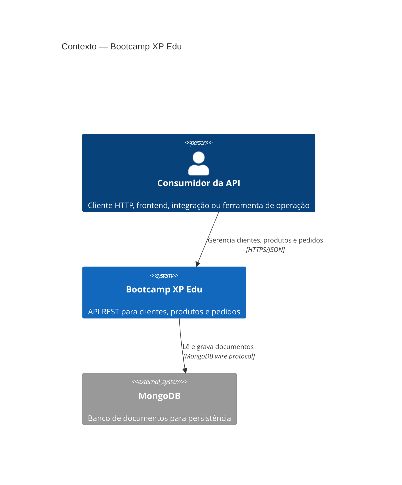
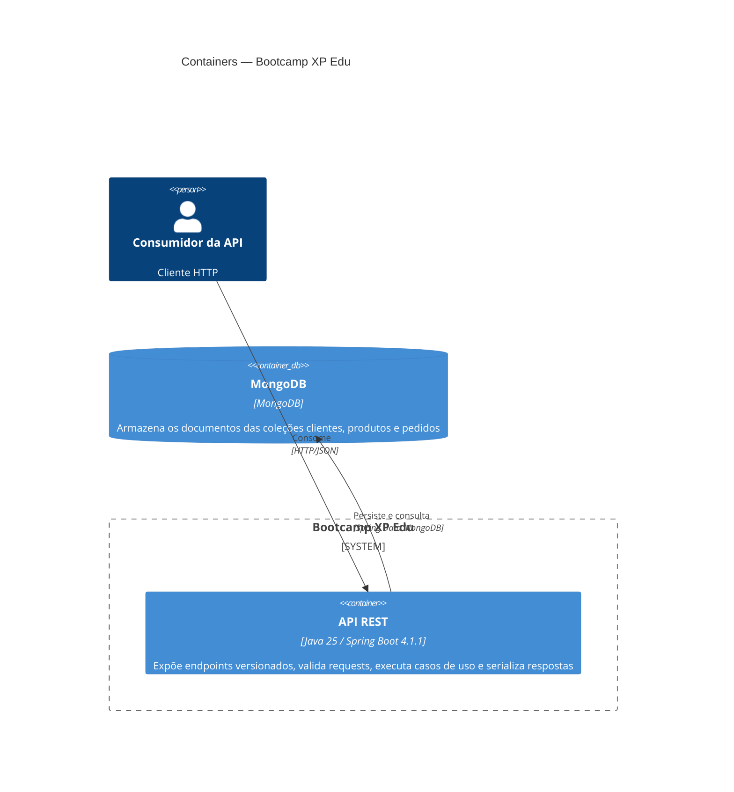
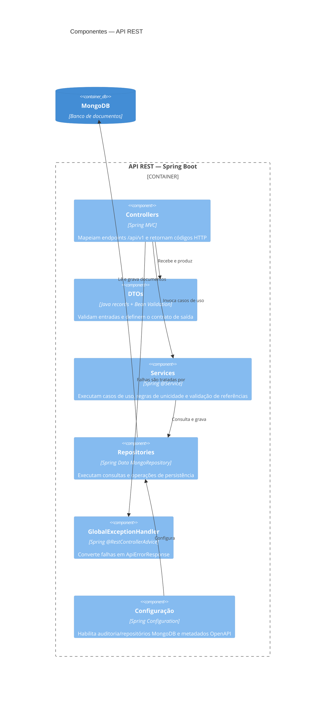
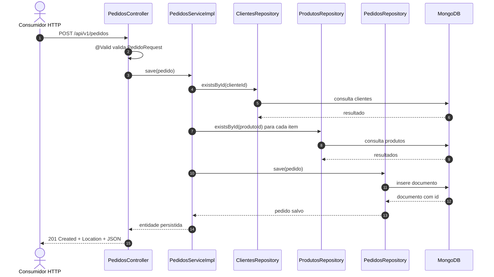

# Arquitetura

## Escopo e estilo arquitetural

O sistema é um monólito modular executado como um único processo Spring Boot. A separação por camadas mantém responsabilidades claras sem introduzir complexidade distribuída:

```text
HTTP/REST → Controller + DTO → Service → Repository → MongoDB
                 ↓
          Exception Handler
```

Os controllers recebem e traduzem requisições HTTP, os services concentram casos de uso e regras de negócio, e os repositories encapsulam o acesso ao MongoDB. Os DTOs impedem que os documentos de persistência sejam usados diretamente como contrato público.

## C4 nível 1 — contexto do sistema



## C4 nível 2 — containers de execução

O sistema possui um container de aplicação e uma dependência de dados. `Controller`, `Service` e `Repository` são componentes internos do container Spring Boot, e não processos implantáveis separados.



## C4 nível 3 — componentes da aplicação



## Fluxo principal: criação de pedido



## Decisões e limites atuais

### Consistência de referências

Pedidos usam referências lógicas (`clienteId` e `produtosId`) em vez de embedding dos documentos completos. O service verifica a existência das referências antes da gravação. Essa decisão reduz duplicação e mantém alterações de cliente/produto fora do documento de pedido, mas não cria transação distribuída nem impede que uma entidade referenciada seja removida depois.

### Unicidade

Clientes e produtos fazem consultas de disponibilidade antes de salvar. Como essa checagem é uma operação separada da escrita, a garantia é suscetível a condição de corrida se não houver índices únicos no MongoDB. Os índices recomendados estão documentados em [data-model.md](data-model.md).

### Tratamento de erros

`GlobalExceptionHandler` retorna `ApiErrorResponse` para validação (`400`), recurso ausente (`404`), conflito (`409`), endpoint inexistente (`404`) e falhas inesperadas (`500`). Falhas inesperadas são registradas no log sem expor detalhes internos na resposta.

### Observabilidade

Os services registram início, conclusão, quantidade e falhas das operações em nível `INFO`/`WARN`/`ERROR`. Ainda não há métricas, tracing distribuído, correlação de request ou endpoint de health documentados no projeto.

### Segurança

Não há autenticação ou autorização implementadas no código atual. O serviço deve ser executado atrás de HTTPS e de um mecanismo de identidade/autorização antes de ser disponibilizado fora de um ambiente confiável.

