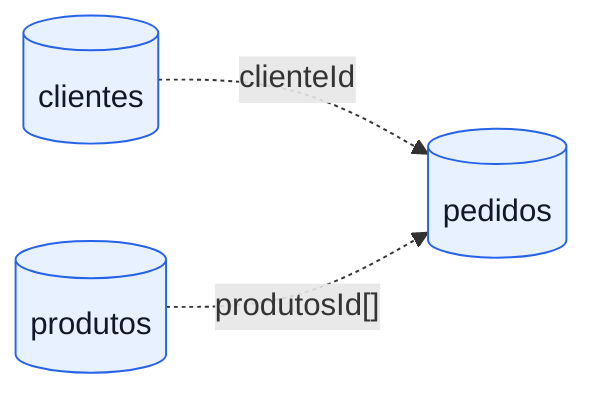

# Modelo de dados MongoDB

## Escolha do modelo

Como o banco é orientado a documentos, o modelo abaixo substitui um diagrama entidade-relacionamento clássico por um diagrama de coleções e referências lógicas. Não existem foreign keys ou `JOINs` no MongoDB.



As setas pontilhadas representam referências armazenadas como strings. A integridade referencial é verificada pela camada de serviço na criação e na atualização de pedidos.

## Coleções e documentos

### `clientes`

```json
{
  "_id": "65f1a2b3c4d5e6f789012345",
  "nome": "Ana Silva",
  "cpf": "12345678900",
  "email": "ana.silva@example.com"
}
```

Regras atuais:

- `nome`, `cpf` e `email` são obrigatórios e não podem ser vazios;
- `email` é validado com `@Email` no request;
- CPF e e-mail são tratados como únicos pela camada de service.

### `produtos`

```json
{
  "_id": "65f1a2b3c4d5e6f789012346",
  "codigo": "PROD-001",
  "nome": "Teclado mecânico",
  "descricao": "Teclado mecânico ABNT2 com iluminação RGB",
  "preco": 249.9
}
```

Regras atuais:

- `codigo`, `nome` e `descricao` são obrigatórios e não podem ser vazios;
- `preco` é obrigatório e deve ser maior que zero;
- `codigo` é tratado como único pela camada de service.

### `pedidos`

```json
{
  "_id": "65f1a2b3c4d5e6f789012347",
  "clienteId": "65f1a2b3c4d5e6f789012345",
  "produtosId": [
    "65f1a2b3c4d5e6f789012346"
  ],
  "valorTotal": 249.9,
  "status": "RECEBIDO"
}
```

Regras atuais:

- `clienteId` e `status` são obrigatórios;
- `produtosId` deve possuir ao menos um item e cada item deve ser preenchido;
- `valorTotal` é obrigatório e não pode ser negativo;
- o cliente e todos os produtos referenciados precisam existir no momento da escrita;
- `status` é uma string livre; não há enum ou máquina de estados implementada.

## Índices e consistência

Consultas observadas no código:

| Coleção | Campo | Operação | Índice recomendado |
| --- | --- | --- | --- |
| `clientes` | `_id` | busca padrão | Índice padrão do MongoDB |
| `clientes` | `cpf` | busca exata e unicidade | `{ cpf: 1 }` único |
| `clientes` | `email` | busca exata e unicidade | `{ email: 1 }` único |
| `produtos` | `_id` | busca padrão | Índice padrão do MongoDB |
| `produtos` | `codigo` | busca exata e unicidade | `{ codigo: 1 }` único |
| `pedidos` | `clienteId` | filtro por cliente | `{ clienteId: 1 }` |
| `pedidos` | `status` | filtro por status | `{ status: 1 }` |

O código habilita `spring.data.mongodb.auto-index-creation`, mas os modelos atuais não declaram `@Indexed`. Para produção, os índices únicos devem ser criados por migração versionada ou declarados explicitamente nos documentos, e a criação deve ser validada no pipeline de deploy.

O tratamento de `DuplicateKeyException` já está previsto para converter violações de unicidade em HTTP `409`, mas isso só terá efeito para índices únicos efetivamente existentes.

## Implicações do modelo

- **Leitura de pedido:** exige apenas o documento do pedido; detalhes de cliente/produto não são materializados na resposta.
- **Atualização de produto:** não reescreve pedidos históricos, pois estes guardam apenas IDs.
- **Exclusão:** apagar cliente ou produto não remove pedidos automaticamente e pode deixar referências lógicas sem alvo; uma política de ciclo de vida deve ser definida antes de usar a operação em produção.
- **Valores monetários:** o código usa `Double`. Para precisão financeira, recomenda-se migrar para `BigDecimal` no domínio e para uma representação decimal suportada pelo driver.
- **Escala:** listagens atuais não possuem paginação, ordenação ou limite explícito. Isso deve ser tratado antes de grandes volumes.

